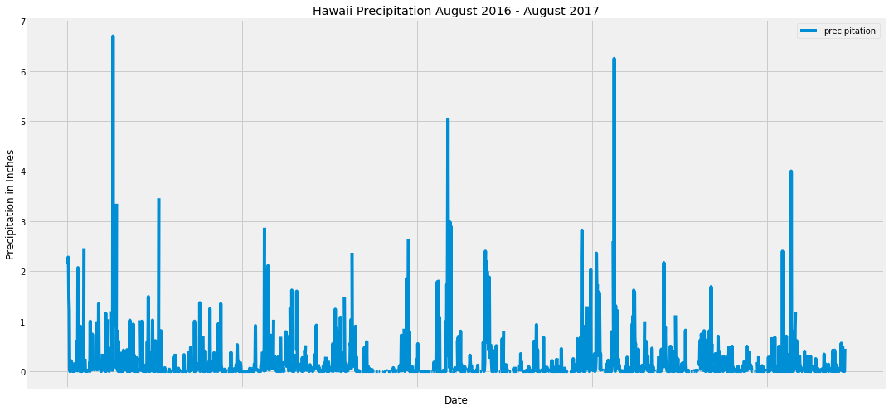
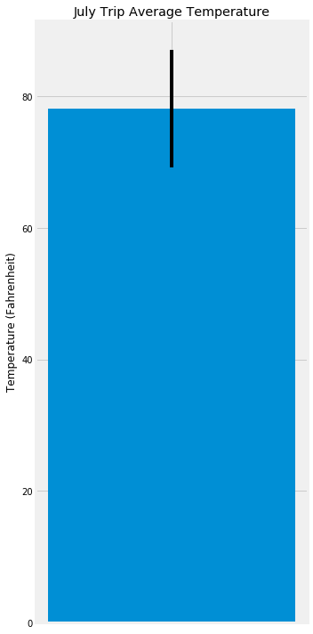

```python
%matplotlib inline
from matplotlib import style
style.use('fivethirtyeight')
import matplotlib.pyplot as plt
```


```python
import numpy as np
import pandas as pd
```


```python
import datetime as dt
```

# Reflect Tables into SQLAlchemy ORM


```python
# Python SQL toolkit and Object Relational Mapper
import sqlalchemy
from sqlalchemy.ext.automap import automap_base
from sqlalchemy.orm import Session
from sqlalchemy import create_engine, func, inspect
```


```python
engine = create_engine("sqlite:///Resources/hawaii.sqlite")
```


```python
# reflect an existing database into a new model
Base = automap_base()
# reflect the tables
Base.prepare(engine, reflect=True)
```


```python
# We can view all of the classes that automap found
Base.classes.keys()
```


    ['measurement', 'station']


```python
# Save references to each table
Measurement = Base.classes.measurement
Station = Base.classes.station
```


```python
# Create our session (link) from Python to the DB
session = Session(engine)
```


```python
#inspect measurement data
inspector = inspect(engine)
columns = inspector.get_columns('measurement')
for c in columns:
    print(c['name'], c['type'])
```

    id INTEGER
    station TEXT
    date TEXT
    prcp FLOAT
    tobs FLOAT
    


```python
#inspect station data
columns = inspector.get_columns('station')
for c in columns:
    print(c['name'], c['type'])
```

    id INTEGER
    station TEXT
    name TEXT
    latitude FLOAT
    longitude FLOAT
    elevation FLOAT
    

# Exploratory Climate Analysis


```python
# Calculate the date 1 year ago from the last data point in the database
last_data_point = session.query(Measurement.date).order_by(Measurement.date.desc()).first()

print(last_data_point[0])
```

    2017-08-23
    


```python
# Design a query to retrieve the last 12 months of precipitation data and plot the results.  Dates are formatted as YYYY-MM-DD.
#Last day in data is 8/23/2017. 12 month range defined as 8/24/2016-8/23/2017.

precipitation_data = session.query(func.strftime("%Y-%m-%d", Measurement.date), Measurement.prcp).\
    filter(func.strftime("%Y-%m-%d", Measurement.date) >= dt.date(2016, 8, 24)).all()
```


```python
# Save the query results as a Pandas DataFrame and set the index to the date column
# Sort the dataframe by date
precipitation_df = pd.DataFrame(precipitation_data, columns = ['date', 'precipitation'])
precipitation_df.set_index('date', inplace = True)
precipitation_df = precipitation_df.sort_values(by = 'date')
precipitation_df.head(10)

```


<div>
<style scoped>
    .dataframe tbody tr th:only-of-type {
        vertical-align: middle;
    }

    .dataframe tbody tr th {
        vertical-align: top;
    }

    .dataframe thead th {
        text-align: right;
    }
</style>
<table border="1" class="dataframe">
  <thead>
    <tr style="text-align: right;">
      <th></th>
      <th>precipitation</th>
    </tr>
    <tr>
      <th>date</th>
      <th></th>
    </tr>
  </thead>
  <tbody>
    <tr>
      <th>2016-08-24</th>
      <td>0.08</td>
    </tr>
    <tr>
      <th>2016-08-24</th>
      <td>NaN</td>
    </tr>
    <tr>
      <th>2016-08-24</th>
      <td>2.15</td>
    </tr>
    <tr>
      <th>2016-08-24</th>
      <td>2.28</td>
    </tr>
    <tr>
      <th>2016-08-24</th>
      <td>2.15</td>
    </tr>
    <tr>
      <th>2016-08-24</th>
      <td>1.45</td>
    </tr>
    <tr>
      <th>2016-08-24</th>
      <td>1.22</td>
    </tr>
    <tr>
      <th>2016-08-25</th>
      <td>0.08</td>
    </tr>
    <tr>
      <th>2016-08-25</th>
      <td>0.00</td>
    </tr>
    <tr>
      <th>2016-08-25</th>
      <td>0.06</td>
    </tr>
  </tbody>
</table>
</div>


```python
# Use Pandas Plotting with Matplotlib to plot the data

fig, ax = plt.subplots(figsize = (15, 7))
precipitation_df.plot(ax = ax, x_compat = True)
ax.set_xlabel('Date')
ax.set_ylabel('Precipitation in Inches')
ax.set_title("Hawaii Precipitation August 2016 - August 2017")
plt.savefig("precipitation.png")
plt.tight_layout()
plt.show()
```





```python
# Use Pandas to calcualte the summary statistics for the precipitation data
precipitation_df.describe()
```


<div>
<style scoped>
    .dataframe tbody tr th:only-of-type {
        vertical-align: middle;
    }

    .dataframe tbody tr th {
        vertical-align: top;
    }

    .dataframe thead th {
        text-align: right;
    }
</style>
<table border="1" class="dataframe">
  <thead>
    <tr style="text-align: right;">
      <th></th>
      <th>precipitation</th>
    </tr>
  </thead>
  <tbody>
    <tr>
      <th>count</th>
      <td>2015.000000</td>
    </tr>
    <tr>
      <th>mean</th>
      <td>0.176462</td>
    </tr>
    <tr>
      <th>std</th>
      <td>0.460288</td>
    </tr>
    <tr>
      <th>min</th>
      <td>0.000000</td>
    </tr>
    <tr>
      <th>25%</th>
      <td>0.000000</td>
    </tr>
    <tr>
      <th>50%</th>
      <td>0.020000</td>
    </tr>
    <tr>
      <th>75%</th>
      <td>0.130000</td>
    </tr>
    <tr>
      <th>max</th>
      <td>6.700000</td>
    </tr>
  </tbody>
</table>
</div>


```python
# Design a query to show how many stations are available in this dataset?
number_of_stations = session.query(Station.id).distinct().count()
number_of_stations
print(f'There are {number_of_stations} number of stations')
```

    There are 9 number of stations
    


```python
# What are the most active stations? (i.e. what stations have the most rows)?
# List the stations and the counts in descending order.
stations = session.query(Measurement.station, func.count(Measurement.station)).group_by(Measurement.station).order_by(func.count(Measurement.station).desc()).all()
print(stations)
most_active_station = stations[0]
most_active_station
```

    [('USC00519281', 2772), ('USC00519397', 2724), ('USC00513117', 2709), ('USC00519523', 2669), ('USC00516128', 2612), ('USC00514830', 2202), ('USC00511918', 1979), ('USC00517948', 1372), ('USC00518838', 511)]
    


    ('USC00519281', 2772)


```python
# Using the station id from the previous query, calculate the lowest temperature recorded, 
# highest temperature recorded, and average temperature most active station?
most_active_station = 'USC00519281'
summary_temps = session.query(func.min(Measurement.tobs), func.max(Measurement.tobs), func.avg(Measurement.tobs)).\
    filter(Measurement.station == most_active_station).all()
print(f"The Lowest Temperature is {summary_temps[0][0]} Fahrenheit")
print(f"The Highest Temperature is {summary_temps[0][1]} Fahrenheit")
print(f"The Average Temperature is {round(summary_temps[0][2], 2)} Fahrenheit")
```

    The Lowest Temperature is 54.0 Fahrenheit
    The Highest Temperature is 85.0 Fahrenheit
    The Average Temperature is 71.66 Fahrenheit
    


```python
# Choose the station with the highest number of temperature observations.
yearly_temps = session.query(Measurement.date, Measurement.tobs).filter(Measurement.station == most_active_station).\
    filter(func.strftime("%Y-%m-%d", Measurement.date) >= dt.date(2016, 8, 24)).all()
# Query the last 12 months of temperature observation data for this station and plot the results as a histogram
yearly_temps_df = pd.DataFrame(yearly_temps, columns = ['date', 'temperature'])
yearly_temps_df.head()
```


<div>
<style scoped>
    .dataframe tbody tr th:only-of-type {
        vertical-align: middle;
    }

    .dataframe tbody tr th {
        vertical-align: top;
    }

    .dataframe thead th {
        text-align: right;
    }
</style>
<table border="1" class="dataframe">
  <thead>
    <tr style="text-align: right;">
      <th></th>
      <th>date</th>
      <th>temperature</th>
    </tr>
  </thead>
  <tbody>
    <tr>
      <th>0</th>
      <td>2016-08-24</td>
      <td>77.0</td>
    </tr>
    <tr>
      <th>1</th>
      <td>2016-08-25</td>
      <td>80.0</td>
    </tr>
    <tr>
      <th>2</th>
      <td>2016-08-26</td>
      <td>80.0</td>
    </tr>
    <tr>
      <th>3</th>
      <td>2016-08-27</td>
      <td>75.0</td>
    </tr>
    <tr>
      <th>4</th>
      <td>2016-08-28</td>
      <td>73.0</td>
    </tr>
  </tbody>
</table>
</div>


```python
# This function called `calc_temps` will accept start date and end date in the format '%Y-%m-%d' 
# and return the minimum, average, and maximum temperatures for that range of dates
def calc_temps(start_date, end_date):
    """TMIN, TAVG, and TMAX for a list of dates.
    
    Args:
        start_date (string): A date string in the format %Y-%m-%d
        end_date (string): A date string in the format %Y-%m-%d
        
    Returns:
        TMIN, TAVE, and TMAX
    """
    
    return session.query(func.min(Measurement.tobs), func.avg(Measurement.tobs), func.max(Measurement.tobs)).\
        filter(Measurement.date >= start_date).filter(Measurement.date <= end_date).all()

# function usage example
print(calc_temps('2016-08-24', '2017-08-23'))
```

    [(58.0, 74.57894736842105, 87.0)]
    


```python
# Use your previous function `calc_temps` to calculate the tmin, tavg, and tmax 
# for your trip using the previous year's data for those same dates.
trip_temps = calc_temps('2017-07-01', '2017-07-10')

print(f"The Lowest Temperature is {trip_temps[0][0]} Fahrenheit")
print(f"The Average Temperature is {round(trip_temps[0][1], 2)} Fahrenheit")
print(f"The Highest Temperature is {trip_temps[0][2]} Fahrenheit")
```

    The Lowest Temperature is 69.0 Fahrenheit
    The Average Temperature is 78.15 Fahrenheit
    The Highest Temperature is 87.0 Fahrenheit
    


```python
# Plot the results from your previous query as a bar chart. 
# Use "Trip Avg Temp" as your Title
# Use the average temperature for the y value
# Use the peak-to-peak (tmax-tmin) value as the y error bar (yerr)

peak_to_peak = trip_temps[0][2] - trip_temps[0][0]
avg_temp = trip_temps[0][1]
fig, ax = plt.subplots(figsize = (5, 10))
ax.bar(1, avg_temp, yerr = peak_to_peak/2, width = 0.4)
ax.set_xticks([1])
ax.set_xticklabels([""])
ax.set_title('July Trip Average Temperature')
ax.set_ylabel('Temperature (Fahrenheit)')
plt.savefig("Trip_Temperature")
plt.tight_layout()
plt.show()
```





```python
# Calculate the total amount of rainfall per weather station for your trip dates using the previous year's matching dates.
# Sort this in descending order by precipitation amount and list the station, name, latitude, longitude, and elevation

trip_rainfall = session.query(Station.station, Station.name, Station.latitude, Station.longitude,
                               Station.elevation, func.avg(Measurement.prcp)).\
    filter(Measurement.station == Station.station).\
    filter(func.strftime(2017, 7, 1, Measurement.date) >= dt.date(2017, 7, 10)).group_by(Station.station).\
    order_by(func.avg(Measurement.prcp).desc()).all()

#load into a dataframe
trip_rainfall_df = pd.DataFrame(trip_rainfall, columns = ['Station', 'Name', 'Latitude', 'Longitude', 
                                                              'Elevation', 'Avg. Precipitation (in.)'])
```


```python

```
